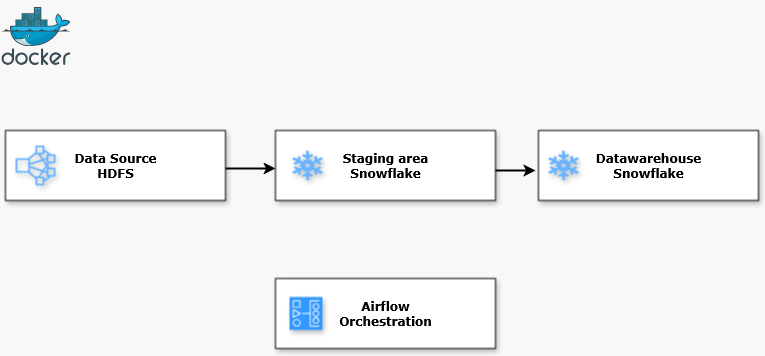
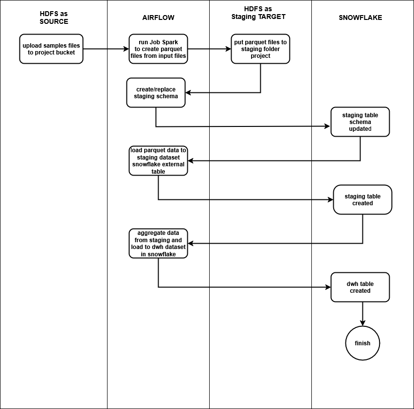
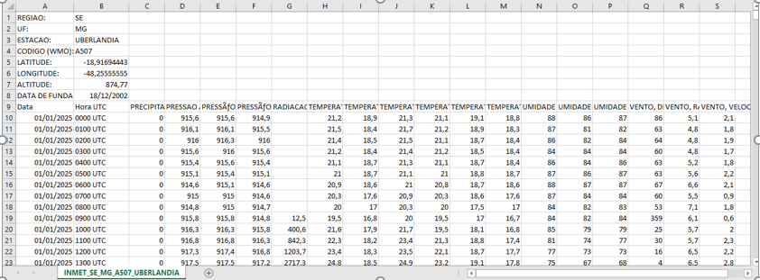
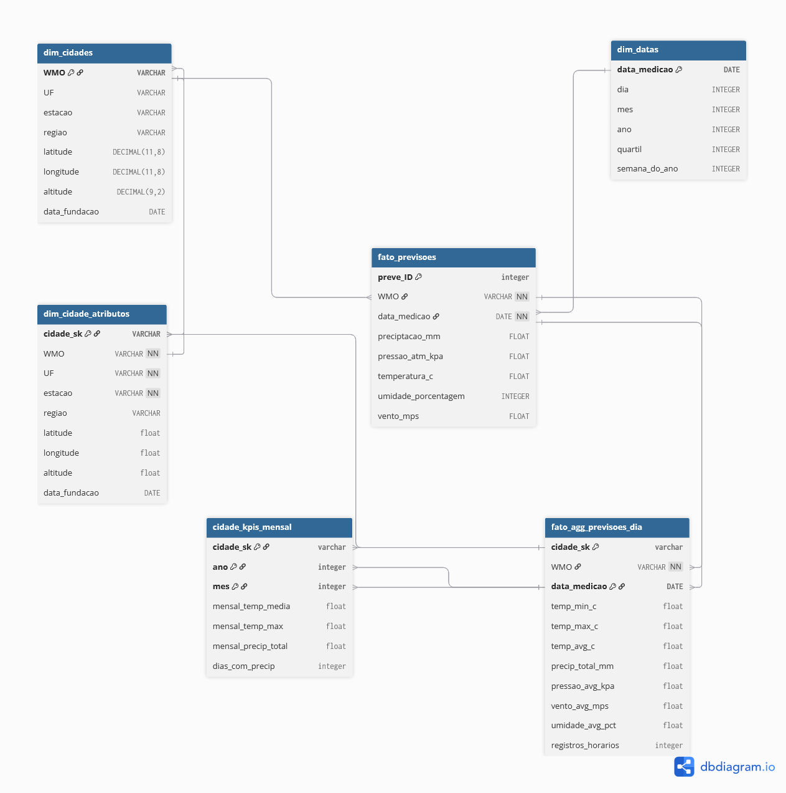

## Data Engineer INMET Project
---

### Scope of Works
---

This is an individual data engineering project that builds an end-to-end
pipeline to create a data warehouse in Snowflake. Some processes run
inside containers, created and managed by Docker Desktop, specifically
running Apache Airflow, HDFS, and Apache Spark. Other processes run in
Snowflake, with Airflow serving as the orchestrator for all of them.

The project flow diagram is described in this picture.

The main thing of this project is you process raw meteorological data
files from INMET (source: https://portal.inmet.gov.br/dadoshistoricos ).
This processing consists of cleaning, formatting, separating data, and
transforming them into parquet files. After that, external tables are
created, using them as a basis to then generate data warehouse tables.

As seen in the diagram, the read files were copied to HDFS. To run the
PySpark job, a Spark cluster was created (by creating spark-master and
spark-worker containers). The PySpark job was created to convert and
transform the INMET raw file. The remaining code created in the project
is in the Airflow DAG.

### Data
---

The data downloaded from the INMET website are in Zip format. They were
uncompressed and copied to HDFS. Three files were used for the project.
Each file contains historical meteorological data for a specific city,
as well as some data from its weather stations.

### DOCKER
---

Docker, in this project, is responsible for creating the entire
containerized environment (except for Snowflake, which uses the AWS
cloud ). Inside this container, the HDFS distributed file system,
Airflow, and Spark were deployed (Spark is a large-scale distributed
data processing system). Airflow uses all of these resources to execute
the process as a whole.

### HDFS
---

HDFS is used to store the raw files (in the input folder), formatted as
CSV. It is also used to store files in the staging area that are in
Parquet format. The PySpark job (executed by Apache Airflow) creates the
stage folder, where the Parquet files will be stored.

### Snowflake
---

Snowflake is used to store the stage tables and to build the data
warehouse. In the external tables we do not store analytical data, only
the schema (with the data) of the Parquet files generated by the PySpark
job. In this case, the files written to the HDFS stage directory are the
data source for those external tables.

We also run queries using the external tables as the source to create
the analitic tables in data warehouse. The queries include aggregations
and data counts.

### Airflow
---

In the Airflow script we run — the PySpark job and DAG — it is necessary
to import operators that will perform several tasks. These operators
will run the PySpark application (the PySpark job is executed via shell
using the spark-submit command), create tables in Snowflake, execute
queries in Snowflake, and mark the start and end of processes.

Specifically, the operators are listed in the table below:

| **Function** | **Operator** |
|----|----|
| Run Pysparkjob | BashOperator |
| Reading files, writing to parquet and pandas files dataframes, executing functions | PythonOperator |
| marking | EmptyOperator |
| Run query | SnowflakeOperator |

The operators mentioned in the table above are based
on Apache Airflow version 3.8.x.

From this script, we make our graph like the image below.

Below is a preview of the input .CSV file:

As a result of running the complete process, we can view the tables
created in the data warehouse below in Snowflake:

dim_cidades_atributos (schema:analitic):

cidade_kpis_mensal (schema:analitic):

Fato_previsos_dia (schema:analitic):

 

### Entity Relationship Diagram
---

The relationship between the tables created in the data warehouse is
shown in the ERD
below.

### Conclusion
---

This project implements an ETL (Extract, Load and Transform) for a
process of creating a data warehouse in Snowflake. The skills acquired
in this small project are:

- Knowledge of Docker, Docker Compose, creating containers, and
  maintaining them.

- Developing PySpark scripts and running jobs in an Apache Spark cluster
  environment.

- Creating DAGs in Apache Airflow to run the ETL process.

- Building an ETL pipeline using Apache Airflow to run PySpark job in a
  containerized cluster with spark-master and spark-worker, and to
  create external tables and execute queries.

- Reading, processing, and writing Parquet files in HDFS using Apache
  Spark and PySpark language.

- Defining relationships between data warehouse tables that can be used
  by end users.
